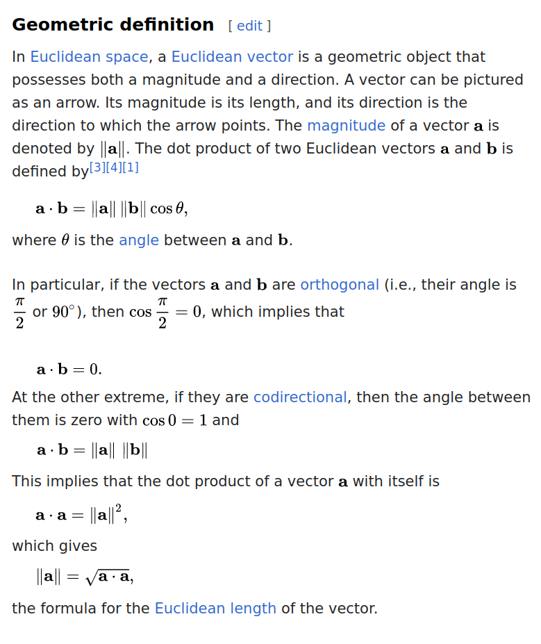
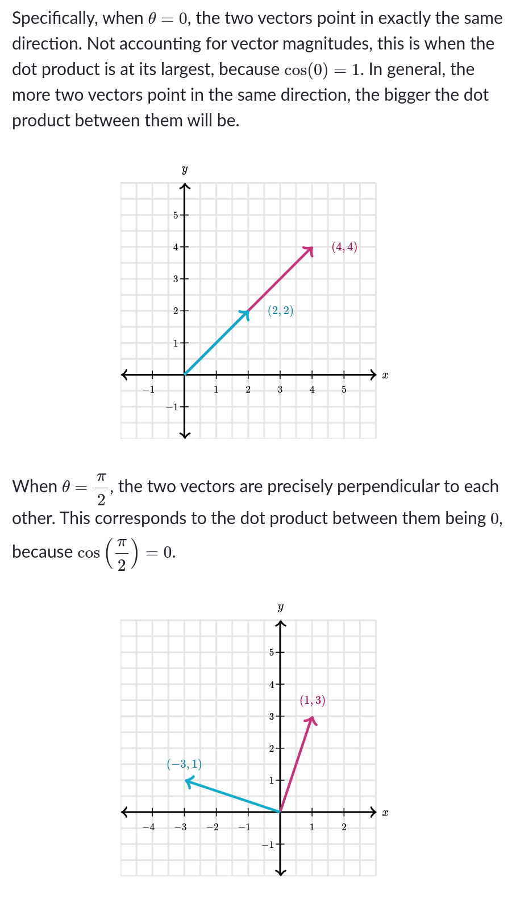
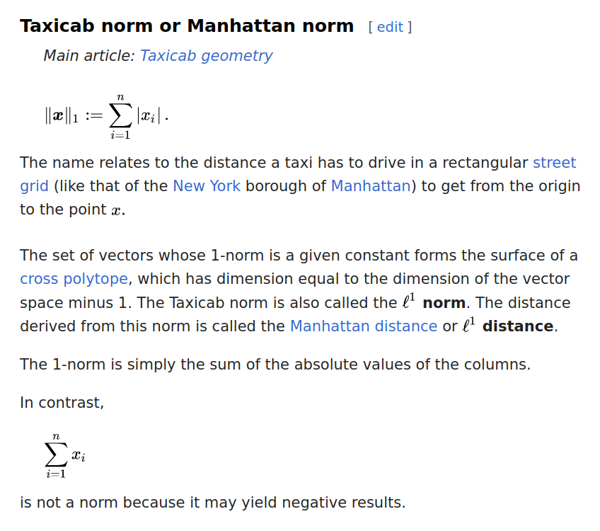
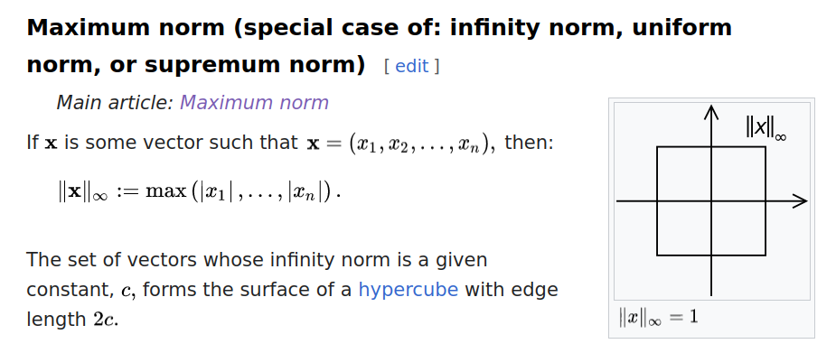
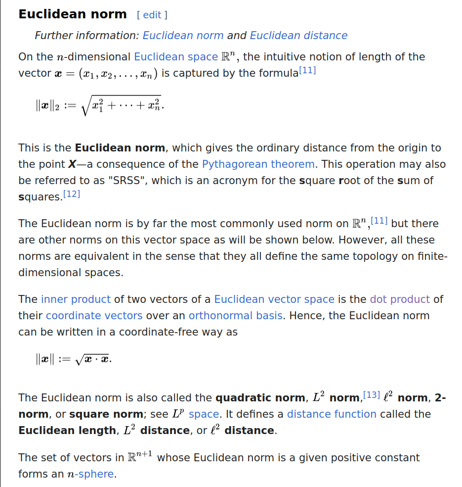

# Enter the Matrix

### Intro

You need a pencil. Pencils are important. And yeah, a paper sheet. A lot of them, actually. And don't forget the course on linear algebra [_Essence of linear algebra_](https://www.youtube.com/playlist?list=PLZHQObOWTQDPD3MizzM2xVFitgF8hE_ab) delivered by 3Blue1Brown.

Another useful resource to start is the module on [linear algebra](https://www.khanacademy.org/math/linear-algebra) of the Khan Academy.

#### Fused Multiply-Accumulate

This [page](https://www.felixcloutier.com/x86/vfmadd132ps:vfmadd213ps:vfmadd231ps) describes how the instructions vfmadd132ps, vfmadd213ps and vfmadd231ps work.

Wait, what's a floating point value, exactly?

A floating point value is a real number using an integer with a fixed precision, called the significand, scaled by an integer exponent of a fixed base.
In computing, floating-point arithmetic (FP) is arithmetic that represents subsets of floating point numbers.
From [Wikipedia](https://en.wikipedia.org/wiki/Floating-point_arithmetic).

Notice that vfmadd132ps, vfmadd213ps and vfmadd231ps are instructions, and not system calls.

An instruction set architecture defines the machine code understood by some processor. An instruction changes the (observable) state of the computer (e.g. changes content of processor registers -including the program counter and the call stack pointer, memory locations in virtual address space, etc...).

A system call, on the other hand, is done by some application program to request services from the operating system kernel. It may correspond to an elementary machine instruction (e.g. SYSENTER or SYSCALL), but the kernel will run a big lot of code before returning to the application program.
From [Wikipedia](https://stackoverflow.com/questions/44201171/what-is-the-difference-between-system-calls-and-instruction-set).

We can find these instructions in [Rust](https://docs.rs/num-traits/latest/num_traits/ops/mul_add/trait.MulAdd.html), [C](https://www.gnu.org/software/c-intro-and-ref/manual/html_node/Fused-Multiply_002dAdd.html) and [C++](https://en.cppreference.com/w/cpp/numeric/math/fma).

#### From C to Rust

[A Guide to Porting C/C++ to Rust](https://locka99.gitbooks.io/a-guide-to-porting-c-to-rust)

### Exercise 0

Before starting, I learnt to use Rust with the [Rustlings](https://github.com/rust-lang/rustlings), a series of exercises which is very helpful to understand Rust and its compiler.

To prepare for this exercise, I implemented the `vector` and `matrix` structures and some help methods as `print`, `get_rows` (for `vector`), `shape` and `is_regular` (for `matrix`).

The goal of the exercise is to implement, for each `struct`, the methods for addition, subtraction and scaling.

I also implemented a funtion to calculate the magnitude of the vector, for which I used the [sqrt](https://doc.rust-lang.org/std/primitive.f32.html#method.sqrt) function implemented for the f32 primitive.

Using [generic types](https://doc.rust-lang.org/book/ch10-01-syntax.html) implies implementing functions for a specific data type if the operators used are not implemented for that particular type. [Traits](https://doc.rust-lang.org/std/ops/index.html#traits) are used in Rust to implement [operator overloading](https://doc.rust-lang.org/rust-by-example/trait/ops.html).
 
For my `main` function I used a list of [colour escape sequences](https://stackoverflow.com/questions/4842424/list-of-ansi-color-escape-sequences) (it's important to note that Rust only considers [hexadecimal escape sequences](https://stackoverflow.com/questions/69981449/how-do-i-print-colored-text-to-the-terminal-in-rust)).

### Exercise 1

For this exercise I had to implement a function calculating a linear combination of an array of vectors and an array of scalars.

To implement the `linear_combination` function, I used the fused multiply-add function implemented by the [mul_add](https://doc.rust-lang.org/std/primitive.f32.html#method.mul_add) function for the `f32` primitive.


### Exercise 2

[Linear interpolation](https://en.wikipedia.org/wiki/Linear_interpolation) is a method of [curve fitting](https://en.wikipedia.org/wiki/Curve_fitting) (i.e. the process of constructing a curve, or mathematical function, that has the best fit to a series of data points) using [linear polynomials](https://en.wikipedia.org/wiki/Polynomial#linear_polynomial) to construct new data points within the range of a discrete set of known data points.

A polynomial is a mathematical expression consisting of indeterminates and coefficients involving only the operations of addition, subtraction, multiplication, and positive-integer powers of variables of degree one, and a linear polynomial is a polynomial of degree one.

For implementing the `lerp` function for the types `f32`, `Vector<f32>` and `Matrix<f32>` I implemented the `Lerp` trait and the function `lerp` derived from it:

```rust
pub trait Lerp<V> {
	fn lerp(&self, u: V, v: V, t: f32) -> V;
}

impl Lerp<f32> for f32 {
	fn lerp(&self, u: f32, v: f32, t: f32) -> f32 {
		if t < 0.0 || t > 1.0 {
			panic!("t must be comprised between 0 and 1");
		}
		(1. - t).mul_add(u, t * v)
	}
}

impl Lerp<Vector<f32>> for Vector<f32> {
	fn lerp(&self, u: Vector<f32>, v: Vector<f32>, t: f32) -> Vector<f32> {
		if t < 0.0 || t > 1.0 {
			panic!("t must be comprised between 0 and 1");
		}
		u.mul_add(1.0 - t, &(t * v))
	}
}

pub fn lerp<V: Clone>(u: V, v: V, t: f32) -> V
where V: Lerp<V>,
{
    u.lerp(u.clone(), v, t)
}

```

I also implemented the `mul_add` function for `Vector<f32>` and the `std::ops::Mul<Vector<f32>>` trait for the `f32` primitive to enable multiplication between `Vector<f32>` and `f32`:
```rust
impl std::ops::Mul<Vector<f32>> for f32 {
	type Output = Vector<f32>;

	fn mul(self, _rhs: Vector<f32>) -> Vector<f32> {
		let mut a: Vector<f32> = Vector::new();
		for el in _rhs.values.iter() {
			a.values.push(el.clone() * self);
			a.rows += 1;
		}
		a
	}
}
```

The same had to be done for `Matrix<f32>`.

### Exercise 3

Here's explanations for the dot product taken from [Wikipedia](https://en.wikipedia.org/wiki/Dot_product) and an article from the [Khan Academy](https://www.khanacademy.org/math/multivariable-calculus/thinking-about-multivariable-function/x786f2022:vectors-and-matrices/a/dot-products-mvc):





### Exercise 4

From [Wiki](https://en.wikipedia.org/wiki/Norm_(mathematics)):








#### Trait Bounds

Trait bounds directly inserted in between angle brackets after `impl<>` specify constraints on the type parameters for the entire implementation block. These bounds apply globally to all functions and associated items within the implementation. For example:

```rust

impl<K: Clone + std::fmt::Display + std::ops::AddAssign> Vector<K> {
    // All methods in this implementation can assume that K implements Clone, Display, and AddAssign.
}
```

In this context, the bounds `K: Clone + std::fmt::Display + std::ops::AddAssign` mean that any type K used in this implementation of `Vector<K>` must implement the `Clone`, `Display`, and `AddAssign` traits.


On the other hand, a `where` clause can be used to specify trait bounds in a more flexible and expressive manner. It allows you to add constraints that are more complex or involve multiple types; it can be applied to individual functions or methods, or to the entire implementation block:

```rust

impl<K> Vector<K>
where K: Clone + std::fmt::Display + std::ops::AddAssign,
{
    // All methods in this implementation can assume that K implements Clone, Display, and AddAssign.
}
```
In this case, the bounds `where K: Clone + std::fmt::Display + std::ops::AddAssign` serve the same purpose as placing the bounds directly between the angle brackets of `impl<>`, but `where` clauses are preferred when the constraints are more complex or to make the code more readable.