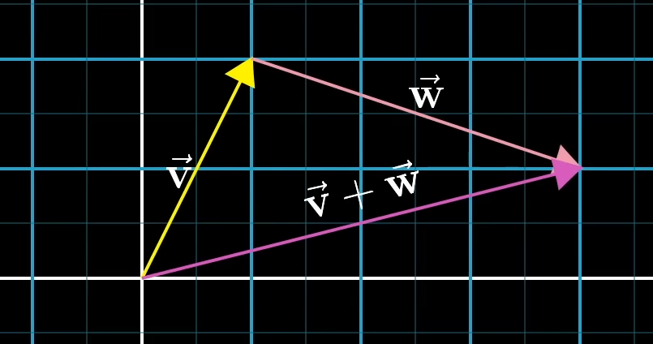
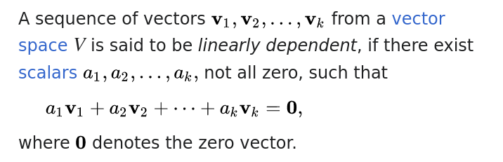

# Enter the Matrix

### Intro

You need a pencil. Pencils are important. And yeah, a paper sheet. A lot of them, actually. And don't forget the course on linear algebra [_Essence of linear algebra_](https://www.youtube.com/playlist?list=PLZHQObOWTQDPD3MizzM2xVFitgF8hE_ab) delivered by 3Blue1Brown.

Another useful resources to start are the module on [linear algebra](https://www.khanacademy.org/math/linear-algebra) and the modules about [vectors](https://www.khanacademy.org/math/precalculus/x9e81a4f98389efdf:vectors) and [matrices](https://www.khanacademy.org/math/precalculus/x9e81a4f98389efdf:matrices) in the "Precalculus" section of the Khan Academy, and the legendary __Introduction to Linear Algebra__ (now at its 6th edition) by [Gilbert Strang](https://en.wikipedia.org/wiki/Gilbert_Strang).

#### Fused Multiply-Accumulate

This [page](https://www.felixcloutier.com/x86/vfmadd132ps:vfmadd213ps:vfmadd231ps) describes how the instructions vfmadd132ps, vfmadd213ps and vfmadd231ps work.

Wait, what's a floating point value, exactly?

A floating point value is a real number using an integer with a fixed precision, called the significand, scaled by an integer exponent of a fixed base.
In computing, floating-point arithmetic (FP) is arithmetic that represents subsets of floating point numbers.
From [Wikipedia](https://en.wikipedia.org/wiki/Floating-point_arithmetic).

Notice that vfmadd132ps, vfmadd213ps and vfmadd231ps are instructions, and not system calls.

An instruction set architecture defines the machine code understood by some processor. An instruction changes the (observable) state of the computer (e.g. changes content of processor registers -including the program counter and the call stack pointer, memory locations in virtual address space, etc...).

A system call, on the other hand, is done by some application program to request services from the operating system kernel. It may correspond to an elementary machine instruction (e.g. SYSENTER or SYSCALL), but the kernel will run a big lot of code before returning to the application program.
From [Wikipedia](https://stackoverflow.com/questions/44201171/what-is-the-difference-between-system-calls-and-instruction-set).

We can find these instructions in [Rust](https://docs.rs/num-traits/latest/num_traits/ops/mul_add/trait.MulAdd.html), [C](https://www.gnu.org/software/c-intro-and-ref/manual/html_node/Fused-Multiply_002dAdd.html) and [C++](https://en.cppreference.com/w/cpp/numeric/math/fma).

#### From C to Rust

[A Guide to Porting C/C++ to Rust](https://locka99.gitbooks.io/a-guide-to-porting-c-to-rust)

### Exercise 00

Before starting, I learnt to use Rust with the [Rustlings](https://github.com/rust-lang/rustlings), a series of exercises which is very helpful to understand Rust and its compiler.

To prepare for this exercise, I implemented the `vector` and `matrix` structures and some help methods as `print`, `rows` (for `vector`), `shape` and `is_regular` (for `matrix`).

The goal of the exercise 00 is to implement, for each `struct`, the methods for addition, subtraction and scaling.

Using [generic types](https://doc.rust-lang.org/book/ch10-01-syntax.html) implies implementing functions for a specific data type if the operators used are not implemented for that particular type. [Traits](https://doc.rust-lang.org/std/ops/index.html#traits) are used in Rust to implement [operator overloading](https://doc.rust-lang.org/rust-by-example/trait/ops.html).
 
For my `main` function I used a list of [colour escape sequences](https://stackoverflow.com/questions/4842424/list-of-ansi-color-escape-sequences) (it's important to note that Rust only considers [hexadecimal escape sequences](https://stackoverflow.com/questions/69981449/how-do-i-print-colored-text-to-the-terminal-in-rust)).

If we consider a vector as a movement, adding two vectors is like starting another movement after the first one is ended. The sum of two vectors will then be a vector starting from the origin and reaching the end of the second vector, whose starting point is the tail of the first vector.



In vector addition, each component of the second vector is added to the corresponding component of the first vector.

In the same way, multiplying a vector by a positive number means stretching or squishing it, while multiplying it by a negative number means stretching or squishing it but in the opposite direction.

Multiplying a vector by a scalar means multiplying each of its components by a scalar.


### Exercise 01

For this exercise 0I had to implement a function calculating a linear combination of an array of vectors and an array of scalars.

To implement the `linear_combination` function, I used the fused multiply-add function implemented by the [mul_add](https://doc.rust-lang.org/std/primitive.f32.html#method.mul_add) function for the `f32` primitive.

**Linear combination** means adding to a one combination of a scalar and a vector one or more combinations of the same kind. However, if the vector are **linearly independent**, the set of their linear combinations may **span** the entire space, while if they are **linearly dependent**, their **span** may be limited to a plane (in 3D space), a line (in 2D space, if they line up) or even a point.

[](https://en.wikipedia.org/wiki/Linear_independence#Definition)

However, we can also consider that any of them is outside the span of the others.

From here we can address the technical definiton of a **basis**:
- the **basis** of a vector space is a set of **linearly independent** vectors that **span** the full space.

Every other vector may be considered as a linear combinattion of the basic vectors.

### Exercise 02

[Linear interpolation](https://en.wikipedia.org/wiki/Linear_interpolation) is a method of [curve fitting](https://en.wikipedia.org/wiki/Curve_fitting) (i.e. the process of constructing a curve, or mathematical function, that has the best fit to a series of data points) using [linear polynomials](https://en.wikipedia.org/wiki/Polynomial#linear_polynomial) to construct new data points within the range of a discrete set of known data points.

A polynomial is a mathematical expression consisting of indeterminantes and coefficients involving only the operations of addition, subtraction, multiplication, and positive-integer powers of variables of degree one, and a linear polynomial is a polynomial of degree one.

For implementing the `lerp` function for the types `f32`, `Vector<f32>` and `Matrix<f32>` I implemented the `Lerp` trait and the function `lerp` derived from it:

```rust
pub trait Lerp<V> {
	fn lerp(&self, u: V, v: V, t: f32) -> V;
}

impl Lerp<f32> for f32 {
	fn lerp(&self, u: f32, v: f32, t: f32) -> f32 {
		if t < 0.0 || t > 1.0 {
			panic!("t must be comprised between 0 and 1");
		}
		(1. - t).mul_add(u, t * v)
	}
}

impl Lerp<Vector<f32>> for Vector<f32> {
	fn lerp(&self, u: Vector<f32>, v: Vector<f32>, t: f32) -> Vector<f32> {
		if t < 0.0 || t > 1.0 {
			panic!("t must be comprised between 0 and 1");
		}
		u.mul_add(1.0 - t, &(t * v))
	}
}

pub fn lerp<V: Clone>(u: V, v: V, t: f32) -> V
where V: Lerp<V>,
{
    u.lerp(u.clone(), v, t)
}

```

I also implemented the `mul_add` function for `Vector<f32>` and the `std::ops::Mul<Vector<f32>>` trait for the `f32` primitive to enable multiplication between `Vector<f32>` and `f32`:
```rust
impl std::ops::Mul<Vector<f32>> for f32 {
	type Output = Vector<f32>;

	fn mul(self, _rhs: Vector<f32>) -> Vector<f32> {
		let mut a: Vector<f32> = Vector::new();
		for el in _rhs.values.iter() {
			a.values.push(*el * self);
		}
		a
	}
}
```

The same had to be done for `Matrix<f32>`.

##### Trait Bounds

Trait bounds directly inserted in between angle brackets after the `impl` keyword specify constraints on the type parameters for the entire implementation block. These bounds apply globally to all functions and associated items within the implementation. For example:

```rust

impl<K: Clone + std::fmt::Display + std::ops::AddAssign> Vector<K> {
    // All methods in this implementation can assume that K implements Clone, Display, and AddAssign.
}
```

In this context, the bounds `K: Clone + std::fmt::Display + std::ops::AddAssign` mean that any type K used in this implementation of `Vector<K>` must implement the `Clone`, `Display`, and `AddAssign` traits.


On the other hand, a `where` clause can be used to specify trait bounds in a more flexible and expressive manner. It allows you to add constraints that are more complex or involve multiple types; it can be applied to individual functions or methods, or to the entire implementation block:

```rust

impl<K> Vector<K>
where K: Clone + std::fmt::Display + std::ops::AddAssign,
{
    // All methods in this implementation can assume that K implements Clone, Display, and AddAssign.
}
```
In this case, the bounds `where K: Clone + std::fmt::Display + std::ops::AddAssign` serve the same purpose as placing the bounds directly between the angle brackets of `impl<>`, but `where` clauses are preferred when the constraints are more complex or to make the code more readable.

### Exercise 03

Here's explanations for the dot product taken from [Wikipedia](https://en.wikipedia.org/wiki/Dot_product) and an article from the [Khan Academy](https://www.khanacademy.org/math/multivariable-calculus/thinking-about-multivariable-function/x786f2022:vectors-and-matrices/a/dot-products-mvc):


The dot product measures how much two vectors point in the same direction.

### Exercise 04

From [Wiki](https://en.wikipedia.org/wiki/Norm_(mathematics)):

[](https://en.wikipedia.org/wiki/Taxicab_geometry)

Taxicab norm is the sum of the size of the two catheti of the triangle whose hypotenuse is represented by the vector.


The Euclidean norm is the root square of the sum of the squares of the two catheti of the triangle whose hypotenuse is represented by the vector.


The supremum norm of a vector is the maximum absolute value of its components, or the maximum distance from the origin among those of the components of the vector. It is used in various mathematical and engineering contexts to measure the size of a vector by focusing on its largest component and is particularly useful in optimization and numerical analysis because it provides a simple and intuitive way to assess the magnitude of vectors in terms of their most significant element.

[To go further](https://www.cs.utexas.edu/users/flame/Notes/NotesOnNorms.pdf).

### Exercise 05

To calculate the [cosine](https://en.wikipedia.org/wiki/Sine_and_cosine) of an angle between two vectors cos(θ), I used the [formula](https://www.wikihow.com/Find-the-Angle-Between-Two-Vectors):


```rust
impl AngleCos<f32> for Vector<f32> {
	fn angle_cos(&self, u: Vector<f32>, v: Vector<f32>) -> f32 {
		u.dot(v.clone()) / (u.norm() * v.norm())
	}
}
```
Cosine is the ratio between the size of the adjacent side of the traingle formed by the vector and its hypotenuse (cf. the acronym [SOH-CAH-TOA](https://www.khanacademy.org/math/geometry/hs-geo-trig/hs-geo-trig-ratios-intro/a/finding-trig-ratios-in-right-triangles))

### Exercise 06

The [cross product](https://en.wikipedia.org/wiki/Cross_product) is a binary operation on two vectors in a three-dimensional oriented Euclidean vector space, and is denoted by the symbol ×. Given two linearly independent vectors a and b, the cross product, a × b (read "a cross b"), is a vector that is perpendicular to both a and b, and thus normal to the plane containing them.

The cross product is defined by the formula

	a × b = ‖ a ‖ ‖ b ‖ sin( θ ) n

where

    θ is the angle between a and b in the plane containing them (hence, it is between 0° and 180°),
    ‖a‖ and ‖b‖ are the magnitudes of vectors a and b,
    n is a unit vector perpendicular to the plane containing a and b, with direction such that the ordered set (a, b, n) is positively oriented.

If the dot product measures how much two vectors point in the same direction, the cross product measures how much two vectors point in different directions.

I will implement the following [formula](https://www.khanacademy.org/math/multivariable-calculus/thinking-about-multivariable-function/x786f2022:vectors-and-matrices/a/cross-products-mvc):


```rust
impl CrossProduct<f32> for Vector<f32> {
	fn cross_product(&self, u: Vector<f32>, v: Vector<f32>) -> Vector<f32> {
		if u.rows() != 3 || v.rows() != 3 {
			panic!("Vectors must have three dimensions.");
		};
		let mut cross = Vector::new();
		cross.push(u[1].mul_add(v[2], -(u[2] * v[1])));
		cross.push(u[2].mul_add(v[0], -(u[0] * v[2])));
		cross.push(u[0].mul_add(v[1], -(u[1] * v[0])));

		cross
	}
}
```

To implement the `cross_product` function I had to implement the `Index` trait for `Vector<f32>`:
```rust
impl std::ops::Index<usize> for Vector<f32> {
	type Output = f32;

	fn index(&self, index: usize) -> &f32 {
		&self.values[index]
	}
}
```

### Exercise 07

To talk about matrix multiplication, we need to address the subject of **linear transformation**. Transformation is a function, taking some vector as input and spitting out some vector as output. It is linear if it has two properties:
- all lines must remain lines, without getting curved;
- the origin must remain fixed in place.

In this way, linear transformation is a way to move around space such that gridlines remain parallel and evely spaced, and such that the origin remains fixed.

Following from this, a matrix may be considered as a series of column vectors representing the positions in which the **basis** (or **unit**) vectors of the particular dimensional space the matrix belongs to land.

Thus, if we want to know where a particular matrix coordinates take a vector, we multiply each entry of the vector with its corresponding matrix column and add together what we get:


In this way we add the scaled version of our new basis vectors.

In the same way, multiplying two matrices means applying two linear transformations one after the other to obtain a composed linear transformation.

We can see matrix multiplication as follows:


Notice the order of the matrices: the matrix representing the first transformation is put on the right and the one representing the new transformation is put on its left.

[](https://www.khanacademy.org/math/precalculus/x9e81a4f98389efdf:matrices/x9e81a4f98389efdf:multiplying-matrices-by-matrices/a/multiplying-matrices)

Matrix multiplication is **associative**, meaning that as long as the transformations are applied in the same order, it does not matter whether two matrices are multiplied by themselves first before their product is multiplied by another matrix.

### Exercise 08

The [trace](https://en.wikipedia.org/wiki/Trace_(linear_algebra)) of an *n × n* square matrix __A__ is defined as:

 

where *a<sub>ii</sub>* denotes the entry on the *i*th row and *i*th column of __A__. The entries of __A__ can be real numbers, complex numbers, or more generally elements of a field __F__. The trace is not defined for non-square matrices.

### Exercise 09

The [transpose](https://en.wikipedia.org/wiki/Transpose) of a matrix is an operator which flips a matrix over its diagonal; that is, it switches the row and column indices of the matrix __A__ by producing another matrix, often denoted by __A<sup>T</sup>__ (among other notations).


### Exercise 10

A matrix is in [row echelon](https://en.wikipedia.org/wiki/Row_echelon_form) form if:

- all rows having only zero entries are at the bottom;
- the leading entry (that is, the left-most nonzero entry) of every nonzero row, called the pivot, is on the right of the leading entry of every row above.

Some texts add the condition that the leading coefficient must be 1 while others require this only in reduced row echelon form.

These two conditions imply that all entries in a column below a leading coefficient are zeros.

The following is an example of a 4 × 5 matrix in row echelon form, but not in reduced row echelon form (see below):


I will make use of [*Gaussian elimination*](https://en.wikipedia.org/wiki/Gaussian_elimination) algorithm to reduce matrices to their row echelon form.

In mathematics, *Gaussian elimination*, also known as *row reduction*, is an algorithm for solving systems of linear equations consisting of a sequence of elementary row operations modifying the matrix until the lower left-hand corner of the matrix is filled with zeros. There are three types of elementary row operations:

- swapping two rows,
- multiplying a row by a nonzero number,
- adding a multiple of one row to another row.

Using these operations, a matrix can always be transformed into an upper triangular matrix, and in fact one that is in row echelon form.

Once all of the leading coefficients (the leftmost nonzero entry in each row) are 1, and every column containing a leading coefficient has zeros elsewhere, the matrix is said to be in __reduced row echelon form__. This final form is unique; in other words, it is independent of the sequence of row operations used. For example, in the following sequence of row operations (where two elementary operations on different rows are done at the first and third steps), the third and fourth matrices are the ones in row echelon form, and the final matrix is the unique reduced row echelon form.


To implement [REF and RREF algorithms](https://web.stanford.edu/~hammond/matrixAlgC20.pdf), I found [this answer](https://math.stackexchange.com/questions/1149771/best-way-to-find-reduced-row-echelon-form-rref-of-a-matrix) inspiring.

### Exercise 11

##### 2-Dimensional Space

Let's start from a view on 2-dimensional space.

Since for a transformation to be linear, gridlines must remain parallel and evenly spaced after the transformation, what happens to the single square of area 1x1 formed by the two basis vectors during the transformation applies to every square in the grid.

The scaling factor by which a linear transformation changes any area is called the determinant of that transformation.

For example, a determinant of 3 implies that the associated linear transformation increases the area by a factor of 3.

It may be 0 if the linear transformation squishes everything into a smaller dimension (in a 2-dimensional space onto a line or a point, for example).

A negative determinant implies an inversion of space orientation.

We can compute the determinant of 2x2 matrices as follows:


##### 3-Dimensional Space

In 3-dimensional space, the basis vectors form a cube with a volume of 1.
Since the determinant gives the factor by which every volume is scaled, we can say that it represents the volume of the parallelepiped in which that cube is turned into.

A volume of 0 means that all space is turned into something with 0 volume, either a flat plane, a line or a single point.

An inversion of space orientation here may be detected with the right hand rule:


If we need our left hand to represent the basis vectors, it means that orientation has changed.


To compute the determinant of 3x3 matrices and higher:

[](https://www.mathsisfun.com/algebra/matrix-determinant.html)

##### General Statements

Since matrix multiplication is associative, the following rule applies:


##### The Exercise

I compared my results with the results of this [calculator](https://www.symbolab.com/solver/matrix-determinant-calculator).

From the subject:

> If you remember the aside on the exterior algebra from before, you might want to know that n-vectors inside an n-dimensional exterior algebra tend to behave a lot like scalars, and are referred to as "pseudoscalars" for this reason.

> The determinant is actually the magnitude of the pseudoscalar (the measure of the n-parallelepiped) which is created by the successive wedge product of all the columns vectors of a square matrix. Read that again, slowly.

### Exercise 12

The [__inverse__](https://www.mathsisfun.com/algebra/matrix-inverse.html) of a matrix of size 2x2 may be calculated as follows:


Hint: *d* is the __inverse__ of *a* and viceversa.

To calculate the __inverse__ of a matrix of greater size, we need to find the [__adjoint matrix__](https://www.sangakoo.com/en/unit/inverse-matrix-using-determinants) of our matrix, that is calculated [as follows](https://www.mathsisfun.com/algebra/matrix-inverse-minors-cofactors-adjugate.html):

Firstly, we compute its __matrix of minors__:


secondly, we compute its __matrix of cofactors__:


by following the following scheme:


and finally, we calculate the __adjugate__ (or __adjoint__) by transposing the elements of the matrix of cofactors:


### Exercise 13

The [rank](https://www.mathsisfun.com/algebra/matrix-rank.html) of a matrix can be defined as [the largest order](https://cp-algorithms.com/linear_algebra/rank-matrix.html) of any non-zero minor in the matrix.

It's also the number of linearly independent vectors in the matrix. That's why a non-zero determinant in a square matrix tells us that all rows (or columns) are linearly independent vectors, so it is "full rank" and its rank equals the number of rows.

### Exercise 14

> In 3D computer graphics, a [viewing frustum](https://en.wikipedia.org/wiki/Viewing_frustum) or view frustum is the region of space in the modeled world that may appear on the screen; it is the field of view of a perspective virtual camera system.

> The view frustum is typically obtained by taking a geometrical [frustum](https://en.wikipedia.org/wiki/Frustum)—that is a truncation with parallel planes—of the pyramid of vision, which is the adaptation of (idealized) cone of vision that a camera or eye would have to the rectangular viewports typically used in computer graphics. Some authors use pyramid of vision as a synonym for view frustum itself, i.e. consider it truncated.

> The exact shape of this region varies depending on what kind of camera lens is being simulated, but typically it is a frustum of a rectangular pyramid (hence the name). The planes that cut the frustum perpendicular to the viewing direction are called the near plane and the far plane. Objects closer to the camera than the near plane or beyond the far plane are not drawn. Sometimes, the far plane is placed infinitely far away from the camera so all objects within the frustum are drawn regardless of their distance from the camera.


> Viewing-frustum culling is the process of removing from the rendering process those objects that lie completely outside the viewing frustum.[6] Rendering these objects would be a waste of resources since they are not directly visible. To make culling fast, it is usually done using bounding volumes surrounding the objects rather than the objects themselves.

We need to calculate a [projection matrix](https://www.scratchapixel.com/lessons/3d-basic-rendering/perspective-and-orthographic-projection-matrix/projection-matrix-introduction.html) for the camera frustum.

> Projection matrices are specialized 4x4 matrices designed to transform a 3D point in camera space into its projected counterpart on the canvas. Essentially, when you multiply a 3D point by a projection matrix, you determine its 2D coordinates on the canvas within NDC (Normalized Device Coordinates) space.

For my algorithm I followed this very good explanation by Mads Elvheim on [StackOverflow](https://stackoverflow.com/questions/724219/how-to-convert-a-3d-point-into-2d-perspective-projection).


The [clip matrix](https://stackoverflow.com/questions/7604322/clip-matrix-for-3d-perspective-projection) is the projection matrix.


To [write an array of floats into a file](https://www.reddit.com/r/learnrust/comments/ggge3j/what_is_the_proper_way_in_rust_of_writing_into_a), I open a file, convert each float value into a string and write it in the file.

### Exercise 15

[Complex numbers](https://www.khanacademy.org/math/algebra-home/alg-complex-numbers) are numbers made up of a real number and an imaginary part _i_. _i_ is the imaginary unit.


Complex numbers are used to take the square root of negative numbers.

In Rust, the [Complex type](https://docs.rs/num/latest/num/complex/struct.Complex.html) has many useful methods we can use.

The [dot product between complex vectors](https://en.wikipedia.org/wiki/Dot_product#Complex_vectors) is given by the dot product of the first term with the [conjugate](https://en.wikipedia.org/wiki/Complex_conjugate) of the second term, i.e. the number with an equal real part and an imaginary part equal in magnitude but opposite in sign.


To calculate the [Euclidean norm](https://en.wikipedia.org/wiki/Norm_(mathematics)#Euclidean_norm_of_complex_numbers) or L2 norm of a complex number, we need to find the absolute value, or norm, of each entry of the complex vector:

[](https://mathworld.wolfram.com/L2-Norm.html)

and the same is also true for [L1 norm](https://mathworld.wolfram.com/L1-Norm.html) and [infinity norm](https://mathworld.wolfram.com/L-Infinity-Norm.html)


Some [help](https://rust-lang-nursery.github.io/rust-cookbook/science/mathematics/complex_numbers.html) to work with Complex number type in Rust.
[Hints](https://earvinkayonga.com/posts/implement-complex-numbers-in-rust) to implement one's own complex number class.

To create tests, I took inspiration from the work of [Glagan](https://github.com/Glagan/42-matrix/tree/master) on GitHub.

I used `assert_eq!()` expression as suggested in [this interesting discussion](https://stackoverflow.com/a/26470361) on StackOverflow.

### Tests

To test, you can run `cargo test` in the root folder or `cargo run` in any `exercise_*` directory.